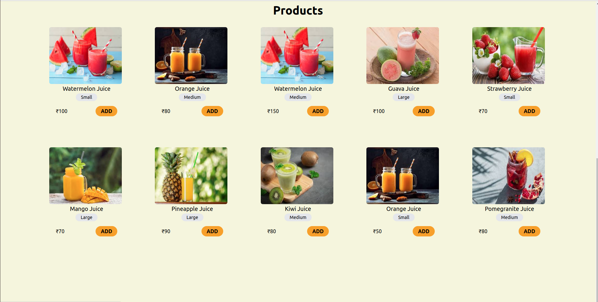

# E-commerce Shopping cart 

This is a very simple e-commerce website built with ReactJs.

# Quick demo:





# Project Summary
The website displays products. Users can add and remove products to/from their cart while also specifying the quantity of each item.

# Running this project

1. Clone the repo 
    ```
    git clone https://github.com/mohini-chauhan/shopping-cart
    ```
2. Install node: follow the link for the detailed documentation

    ```
    https://docs.npmjs.com/downloading-and-installing-node-js-and-npm
    ```

3. Install dependencies

    ```
    npm install
    ```
4. Run project
    ```
    npm start
    ```
